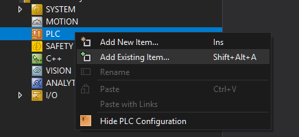
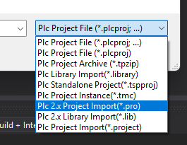

# TwinCAT 3.1.4026 Notes 
This is a personal repo for personal use relating to TwinCAT 3.1.4026, I'm adding it here so other people can read it as well. **This repo is not officially Beckhoff**. If you do need further help with TwinCAT, please contact your local Beckhoff Subsidiary/Representatives.  

### - Content:
- [Migration via Command Line](#Migration-via-Command-Line)
- Connecting to TwinCAT 3.1.4024 Target from TwinCAT 3.1.4026
- Uninstalling TwinCAT 3.1.4026
- Downgrade to TwinCAT 3.1.4024
- Run TwinCAT 3.1.4026 locally on Dev Laptop
- Control TwinCAT via Command Line
- Increasing Memory for Usermode Runtime
- TwinCAT 2 and TwinCAT 3.1.4026 on same machine
- Convert TwinCAT 2 projects (.pro) to TwinCAT 3.1.4026
- Visual Studio Integration issues

>[!Important] 
> - Please note that `Windows 10 IoT Enterprise 2016` cannot support TwinCAT 4026 as there is a crucial `.NET package` not avialable for Windows 10 IoT Enterprise 2016
> - The OS on the PC/IPC/ePC will need to be upgraded.


## Migration via Command Line
>[!Important]
> - Please **DO NOT** use a VPN
> - Please close any TwinCAT programs/folders that are currently open
> - Please read through all steps prior to starting  


- The steps below are completely via command line.
- Attempt installing the GUI the default way prior to this method.
- The steps below are in case IT security policy are preventing Admin rights.
- the GUI open command line multiple times in the background.
- If you have the ability to be Admin for a multiple minutes then please use that method.

0. Download [TwinCAT Package Manager](https://www.beckhoff.com/en-gb/support/download-finder/search-result/?download_group=725136885&download_item=725320261)
1. Start the Command Prompt as `Administrator`
2. Navigate with `cd` commands to the directory where the TwinCAT Package Manager installer (`TwinCAT-Package-Manager-GUI-Setup.exe`) was downloaded to.
3. Execute the following command in command line.  
	 `TwinCAT-Package-Manager-GUI-Setup.exe NO4024CHECK="true"` 
4. Check if the package manager can see any feeds `tcpkg list`
	1. if not, run the following, replace the square brackets with necessary data
```shell
tcpkg source add -n="Beckhoff Stable Feed" -s=https://public.tcpkg.beckhoff-cloud.com/api/v1/feeds/stable --priority=[UniqueValue, highest is 1] -u=[myBeckhoff Email] --password=[myBeckhoff Password]
```
5. Install TcMigrateCli package
```shell
tcpkg install TwinCAT.XAE.MigrateCli
```
6. You can skip this step if you want, Run the migration in test mode
```shell
TcMigrateCmd upgrade
```
6. Then run the migration without testing
```shell
TcMigrateCmd upgrade --whatIf False
```
8. This will start the migration
	- Best time to have a coffee/tea because this will take a while
9. Halfway through, your computer will request to restart
	1. When it restarts **DO NOT DO ANYTHING**
	2. A new command prompt should open/be requested to open and will continue the migration
	3. This should attempt to reinstall the equivalent 4026 version of 4024 packages you had installed  
>[!Important]
> - if this is the first time your laptop/desktop/machine is using TwinCAT
> - Open TwinCAT via the Windows 11 taskbar system tray the first time
### - Additional Command Line Commands
 https://infosys.beckhoff.com/content/1033/tc3_installation/15698626059.html?id=5147078465983576506
 
## Control/Connect to a 4024 XAR via 4026 XAE
- due to the significant difference between v4026 and v4024
- A remote manager will need to be used
- As of current (22/8/2025), the remote manager for v4024 and older has been moved to their own feed called "Outdated"

1. Open Package Manager
2. Open Settings
3. Go to `Feeds`
4. Add `Outdated` from the dropdown list and that should autofill the rest apart from login credentials

5. Now `Remote Manager` workload should have mutliple options for 4024,4022,4020,4018

### - Via command line
- To add Outdated feed to source lise
```shell
tcpkg source add -n="Beckhoff Outdated Feed" -s=https://public.tcpkg.beckhoff-cloud.com/api/v1/feeds/outdated --priority=1 -u=[myBeckhof email] --password=[myBeckhoff Password]
```

## Uninstalling TwinCAT 3.1.4026
- Rather than going via "Add or Remove Programs" in Windows
1. Start the command prompt as Administrator
2. Check what is installed: 
```shell
tcpkg list -i
```
3. Then uninstall: 
```shell
tcpkg uninstall all
```
4. Remove `Beckhoff` directory from `Program Data`,`Program Files`, `Program Files(x86)`

## Downgrade from TwinCAT 3.1.4026 to TwinCAT 3.1.4024
- If you try to run a 4024 .exe with v4026 installed, you'll get an error stating "New version is installed"
- **DO NOT** remove 4026 via "Add or Remove Programs"
- Follow the steps above with `Command Prompt`
- Then download the 4024 .exe
- If you have a partial install of v4026, you'll need to complete it prior to uninstalling to confirm everything has been removed

## Run locally on Windows 11 Dev Laptop
- There are 2 methods to running TwinCAT project localy on Windows 11
- Run the following powershell executable:  
`C:\Program Files (x86)\Beckhoff\TwinCAT\3.1\System\DisableVirtualizationBasedSecurity.ps1`
- Alternatively, install the workload `Usermode Runtime` which creates a target that is running above the OS.  

>[!Important] 
> - Motion on Usermode runtime
> - Please note, to run NC locally you'll need to download an additional package from the Package Manager which is no longer apart of the Usermode Runtime workload.
> - Switch the view of `Package Manager` to `Packages`  
>  
> - Search and download the `TwinCAT.XARUM.NCPTP` package

## ADS PowerShell commands
- There is a package that needs to be downloaded called `TcXaeMgmt`
- Open PowerShell as Administrator and run:  
	```
	Install-Module -Name TcXaeMgmt
	```
- This requires a minimum PowerShell version of `7.0` and TwinCAT `3.1.4024.10`
- For more checkout the Infosys page about [ADS PowerShell Module](https://infosys.beckhoff.com/content/1033/tc3_ads_ps_tcxaemgmt/15510368395.html?id=472193331586139353)

## Increasing Memory for Usermode Runtime
- You'll need to edit the following `.xml` file.  
	`C:\Program Files (x86)\Beckhoff\TwinCAT\3.1\Runtimes\UmRT_Template\3.1\TcRegistry.xml`
- Open said file and add the following lines to `Key Name="System"`.  
```xml
<Value Name="LockedMemSize" Type="DW">33554432</Value> 
<Value Name="HeapMemSizeMB" Type="DW">512</Value>
```
- You should have something like this:
```xml
<?xml version="1.0"?>
<TcRegistry>
	<Key Name="HKLM">
		<Key Name="Software">
			<Key Name="Beckhoff">
				<Key Name="TwinCAT3">
					<Value Name="CurrentVersion" Type="SZ">3.1</Value>
					<Key Name="System">
						<Value Name="RunAsDevice" Type="DW">1</Value>
						<Value Name="LockedMemSize" Type="DW">33554432</Value>
						<Value Name="HeapMemSizeMB" Type="DW">512</Value>
					</Key>
					<Key Name="3.1">						
					</Key>
				</Key>
			</Key>
		</Key>
	</Key>
</TcRegistry>
```

## TwinCAT 2 and TwinCAT 3.1.4026 on same machine
- When moving to TC3.1 v4026
- If you had TwinCAT 2 installed, it would have been removed as well
- TwinCAT 2 can be reinstalled from the Package manager
- You'll need to make sure the `Outdated` feed is activated
- It won't be a `Workload` so you will need to swap to `Packages` view to find it
	- This is the top left button inside the `Package Manager`
- Seach `TwinCAT.XAE.TC2Engineering` and it should show up
- Download those packages and TwinCAT 2 options should appear in the System Icon as options  


## Convert TwinCAT 2 projects (.pro) to TwinCAT 3
- You'll need to install the folllowing packages: `TwinCAT.XAE.PLC.Tc2ProjectConverter`, `TwinCAT.XAE.TC2Engineering` from Package Manager.
- Open a `TcXaeShell (32-bit)` and change build to `4024`
- Within a TwinCAT Solution .
	- Right-click `PLC` and click `Add Existing Item...`  
	  
	- Then you can import a `.pro` file into TwinCAT  
	  

# Visual Studio Integration issues
## VS2026 beta
- Having VS2026 beta installed can prevent `Package Manager` from function correctly.
- Trying to installed packages after having VS2026 beta installed could cause the following error:  
	`Error: The given key 'VS18' was not present in the dictionary. Upgrade of TcPkgUI packages failed. ExitCode: 574`  
- You'll need to uninstall VS2026 via the `Visual Studio Installer` which will allow the package manager to function again.

## TE9000 - Safety Projects
- Trying to add a `TE9000` Safety project to a TwinCAT solution open in Visual Studios
	- Option to `add New item...` is greyed.
	- Safety project templates won't load. after pressing `add New item...`.
- To resolve this, in the `Visual Studio Installer`, select the `Individual Components` tab and type `DSL` which should show either `modelling SDK/DSL tools`
- It might show up as a different name, but if it the only one when searching. That will be the necessary component to install
	
## TF2000 - HMI projects